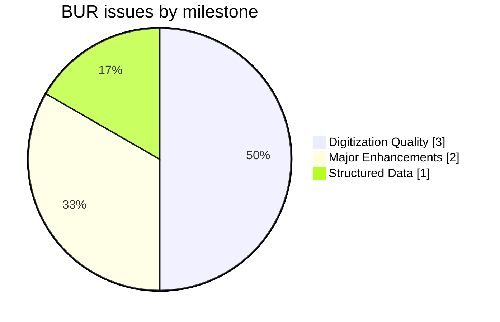
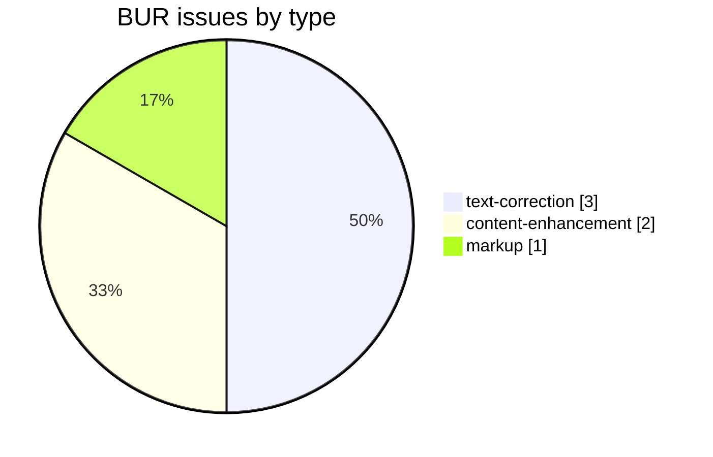
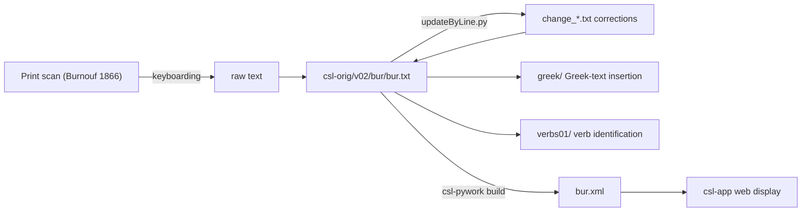

# BUR — Burnouf *Dictionnaire classique sanscrit-français*

_Created: 09-04-2020 · Last updated: 05-07-2026_

Development and correction repository for **Émile Burnouf's *Dictionnaire classique sanscrit-français* (1866)**, a Sanskrit→French dictionary, part of the [Cologne Digital Sanskrit Lexicon](https://www.sanskrit-lexicon.uni-koeln.de/) (CDSL). The canonical source text lives in [`csl-orig/v02/bur/bur.txt`](https://github.com/sanskrit-lexicon/csl-orig/blob/master/v02/bur/bur.txt) (19,776 entries); this repository holds the development, correction, and enrichment work (Greek-text insertion, verb identification, per-issue corrections).

## Documentation

- [CLAUDE.md](CLAUDE.md) — repository guide and data-format reference.
- [DATA_DICTIONARY.md](DATA_DICTIONARY.md) — markup tag reference.
- [CONTRIBUTING.md](CONTRIBUTING.md) · [CODE_OF_CONDUCT.md](CODE_OF_CONDUCT.md)

## Contents

| Path | Purpose |
|---|---|
| `greek/` | Greek-text insertion pipeline (`prep1.py`, `digentry.py`, `proof.py`, `updateByLine.py`, proofing data) |
| `verbs01/` | Verb-identification: maps Burnouf verb entries to roots, with Devanāgarī renderings |
| `burissues/` | Per-issue working files (issue3, issue4, issue5) |
| `CITATION.cff` | Machine-readable citation metadata |
| `DATA_DICTIONARY.md` | Markup tag reference |

## Usage example

A real entry from [`csl-orig/v02/bur/bur.txt`](https://github.com/sanskrit-lexicon/csl-orig/blob/master/v02/bur/bur.txt) — line 60, the "akarRa" entry:

```
60:{#akarRa#}¦  <ab>a.</ab> sourd, <ab>m à m.</ab> sans oreille.
```

To correct the French gloss (e.g. `sourd` → `sourde`, an agreement fix), write a paired-line change file and apply it with `updateByLine.py`:

```
; issueNNN: fix adjective agreement in "akarRa" gloss
60 old {#akarRa#}¦  <ab>a.</ab> sourd, <ab>m à m.</ab> sans oreille.
60 new {#akarRa#}¦  <ab>a.</ab> sourde, <ab>m à m.</ab> sans oreille.
```

```sh
python updateByLine.py bur.txt change_60.txt bur_corrected.txt
```

(Illustrative — no actual defect at this line; the workflow above is exact, only the fictitious agreement fix is invented to demonstrate the change-file mechanics.)

## Timeline

| Period | Activity |
|---|---|
| 2020-04 | Repository initialized |
| 2022-05 | Greek-text addition |
| 2023-02 – 2023-03 | Misc. corrections, proofreading |
| 2024-03 – 2024-04 | Verb identification (`verbs01/`) |
| 2026-05 | Issue taxonomy, citation metadata, documentation |

## Projects & Milestones

| Milestone | Open | Closed | Total |
|---|---|---|---|
| Dictionary to Book | 0 | 0 | 0 |
| Digitization Quality | 0 | 3 | 3 |
| Structured Data | 0 | 1 | 1 |
| Major Enhancements | 1 | 1 | 2 |
| **Total** | **1** | **5** | **6** |



## Issues



### Open

| # | Title | Type | Severity | Milestone |
|---|---|---|---|---|
| 1 | verbs01 | content-enhancement | medium | Major Enhancements |

### Solved

| # | Title | Type | Severity | Milestone |
|---|---|---|---|---|
| 2 | greek text | content-enhancement | medium | Major Enhancements |
| 3 | Misc. corrections | text-correction | medium | Digitization Quality |
| 4 | Proofread Greek text | text-correction | minor | Digitization Quality |
| 5 | Misc. corrections | text-correction | minor | Digitization Quality |
| 6 | [markup] Minor bur.txt Markup Oddities | markup | minor | Structured Data |

## Labels

### Type labels
| Label | Meaning |
|---|---|
| `link-target` | Click-throughs from `<ls>` abbreviations to scanned PDF pages |
| `link-splitting` | Splitting combined `SOURCE N,N` refs into per-page links |
| `markup` | Normalising XML tag content |
| `text-correction` | Corrections to French/Sanskrit definitions or headwords |
| `content-enhancement` | New material or structural additions beyond correction |
| `encoding` | SLP1/IAST transcoding, character normalisation |
| `scan-quality` | Replacing blurry/skewed/missing scan pages |
| `bug` | Broken links, XML errors, broken downloads |
| `question` | Scholarly questions requiring research |

### Severity labels
| Label | Meaning |
|---|---|
| `minor` | Targeted fix — a handful of lines or a single file |
| `medium` | Standard unit of work — one batch of corrections |
| `hard` | Large effort spanning many sources or files |

## Contributors

| Contributor | Commits |
|---|---|
| funderburkjim | 19 |
| Mārcis Gasūns | 8 |
| AnnaRybakovaT | 3 |

## Source

- **Authors**: Burnouf, Émile; Leupol, L.
- **Title**: *Dictionnaire classique sanscrit-français*
- **Place / Publisher**: Paris: Maisonneuve
- **Year**: 1866
- **Language pair**: Sanskrit → French
- **Entries (digital edition)**: 19,776
- **License (digital edition)**: CC BY-SA 4.0
- See [CITATION.cff](CITATION.cff) for machine-readable citation.

## Encoding

- UTF-8 (NFC) throughout.
- Sanskrit text in SLP1 transliteration, wrapped in `{#…#}`; French gloss/italic display text in ``.
- Devanāgarī and IAST are generated at display time, not stored in the source.
- Greek-script references (e.g. in star-name notes) stored as UTF-8 Greek inside `<lang n="greek">…</lang>`.

## How it works



---
*Issue taxonomy and documentation per the [Cologne issue runbook](https://github.com/sanskrit-lexicon/csl-observatory/blob/main/runbook/cologne-issue-runbook.md).*

_Dr. Mārcis Gasūns_
